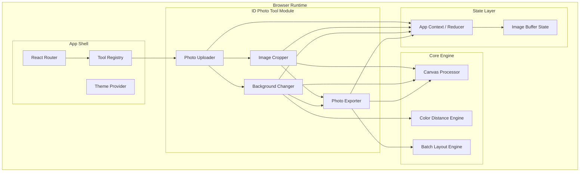
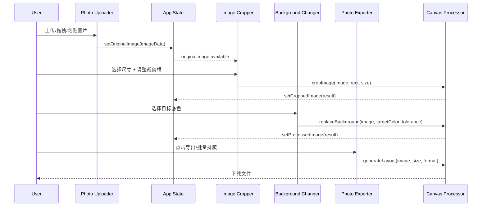

# Design Document: ID Photo Tool

## Overview

证件照裁剪和更换底色工具是一个独立部署的 React 单页应用（SPA），运行在 `tools/id-photo` 目录下，通过 Vercel 平台独立部署。所有图片处理均基于 HTML5 Canvas API 在浏览器本地完成，不涉及任何服务端通信，确保用户隐私。

### 技术选型

| 类别 | 选择 | 理由 |
|------|------|------|
| 框架 | React 18 + TypeScript | 类型安全、组件化开发 |
| 构建工具 | Vite | 快速 HMR、优秀的构建性能 |
| 样式 | Tailwind CSS | 快速样式开发、响应式支持 |
| 裁剪 | react-image-crop | 轻量纯 React 实现、支持固定比例裁剪、Canvas 导出 |
| 背景处理 | Canvas API (自研) | 基于颜色距离算法的像素级替换，无需外部依赖 |
| PDF 导出 | jsPDF | 成熟的客户端 PDF 生成库，支持高 DPI 图片 |
| 路由 | React Router v6 | 支持懒加载、嵌套路由 |
| 状态管理 | React Context + useReducer | 轻量级状态管理，满足工具应用需求 |
| 主题 | Tailwind dark mode (class策略) | 支持系统跟随和手动切换 |

### 设计原则

1. **隐私优先**: 零网络传输，所有处理在浏览器内存中完成
2. **插件化扩展**: 基于 TypeScript 接口的工具注册机制，新工具只需实现接口即可接入
3. **渐进式交互**: 步骤引导但不限制操作顺序，用户可自由跳转
4. **性能优化**: 组件懒加载 + Canvas 离屏处理，保证 UI 流畅
5. **内存安全**: 状态重置时显式释放 Canvas 引用，防止内存泄漏

## Architecture

### 系统架构图



### 目录结构

```
tools/id-photo/
├── index.html
├── package.json
├── vite.config.ts
├── vercel.json
├── tailwind.config.ts
├── tsconfig.json
├── postcss.config.js
├── public/
│   └── favicon.ico
├── src/
│   ├── main.tsx                    # 应用入口
│   ├── App.tsx                     # 根组件（Router + Providers）
│   ├── vite-env.d.ts
│   ├── plugins/
│   │   ├── types.ts                # ToolPlugin 接口定义
│   │   └── registry.ts             # 工具注册数组
│   ├── core/
│   │   ├── canvas-processor.ts     # Canvas 处理引擎
│   │   ├── color-engine.ts         # 颜色距离计算与替换
│   │   └── layout-engine.ts        # A4 排版计算引擎
│   ├── modules/
│   │   └── id-photo/
│   │       ├── index.tsx           # 模块入口（步骤导航）
│   │       ├── components/
│   │       │   ├── PhotoUploader.tsx
│   │       │   ├── ImageCropper.tsx
│   │       │   ├── BackgroundChanger.tsx
│   │       │   ├── PhotoExporter.tsx
│   │       │   ├── StepNavigator.tsx
│   │       │   └── CompareSlider.tsx
│   │       ├── hooks/
│   │       │   ├── useImageState.ts
│   │       │   ├── useCrop.ts
│   │       │   └── useBackgroundReplace.ts
│   │       ├── constants/
│   │       │   └── photo-sizes.ts  # 标准尺寸配置
│   │       └── context/
│   │           └── PhotoContext.tsx
│   ├── components/
│   │   ├── Layout.tsx              # 全局布局
│   │   ├── ToolCard.tsx            # 首页工具卡片
│   │   ├── ThemeToggle.tsx         # 主题切换
│   │   ├── PrivacyBadge.tsx        # 隐私声明标识
│   │   └── LoadingSpinner.tsx      # 加载指示器
│   ├── hooks/
│   │   └── useTheme.ts
│   ├── styles/
│   │   └── index.css               # Tailwind 入口
│   └── utils/
│       ├── file-validators.ts      # 文件格式/大小校验
│       └── image-helpers.ts        # 图片工具函数
└── tests/
    ├── setup.ts
    ├── core/
    │   ├── canvas-processor.test.ts
    │   ├── color-engine.test.ts
    │   └── layout-engine.test.ts
    └── modules/
        └── id-photo/
            ├── photo-uploader.test.tsx
            └── image-cropper.test.tsx
```

### 数据流



## Components and Interfaces

### ToolPlugin 接口

```typescript
// src/plugins/types.ts
import { ComponentType, LazyExoticComponent } from 'react';

export interface ToolPlugin {
  /** 唯一标识符 */
  id: string;
  /** 工具显示名称 */
  name: string;
  /** 图标组件 */
  icon: ComponentType<{ className?: string }>;
  /** 简要描述 */
  description: string;
  /** 路由路径（如 '/id-photo'） */
  route: string;
  /** React 懒加载组件引用 */
  component: LazyExoticComponent<ComponentType>;
}
```

### Tool Registry

```typescript
// src/plugins/registry.ts
import { lazy } from 'react';
import type { ToolPlugin } from './types';
import { CameraIcon } from '../components/icons';

export const tools: ToolPlugin[] = [
  {
    id: 'id-photo',
    name: '证件照处理',
    icon: CameraIcon,
    description: '裁剪标准尺寸、更换底色、批量排版导出',
    route: '/id-photo',
    component: lazy(() => import('../modules/id-photo')),
  },
  // 未来新工具只需在此添加
];
```

### Canvas Processor 核心接口

```typescript
// src/core/canvas-processor.ts

export interface CropOptions {
  /** 裁剪区域（相对于原图的坐标） */
  sourceRect: { x: number; y: number; width: number; height: number };
  /** 输出尺寸（像素） */
  outputSize: { width: number; height: number };
  /** 旋转角度（0, 90, 180, 270） */
  rotation?: number;
  /** 是否水平翻转 */
  flipHorizontal?: boolean;
  /** 亮度调整（-50 到 +50） */
  brightness?: number;
  /** 对比度调整（-50 到 +50） */
  contrast?: number;
}

export interface CropResult {
  /** 裁剪后的图片数据 */
  imageData: ImageData;
  /** Canvas 元素引用（用于导出） */
  canvas: HTMLCanvasElement;
}

/**
 * 在离屏 Canvas 上执行裁剪操作
 */
export function cropImage(
  source: HTMLImageElement | HTMLCanvasElement,
  options: CropOptions
): CropResult;

/**
 * 将 Canvas 导出为 Blob
 */
export function canvasToBlob(
  canvas: HTMLCanvasElement,
  format: 'image/jpeg' | 'image/png',
  quality?: number
): Promise<Blob>;

/**
 * 将 Canvas 导出为 Data URL
 */
export function canvasToDataURL(
  canvas: HTMLCanvasElement,
  format: 'image/jpeg' | 'image/png',
  quality?: number
): string;
```

### Color Engine 接口

```typescript
// src/core/color-engine.ts

export interface RGB {
  r: number; // 0-255
  g: number; // 0-255
  b: number; // 0-255
}

export interface RGBA extends RGB {
  a: number; // 0-255
}

export interface BackgroundReplaceOptions {
  /** 目标替换颜色 */
  targetColor: RGB;
  /** 颜色容差（0-100），默认 30 */
  tolerance: number;
  /** 边缘羽化像素数，默认 1 */
  featherRadius?: number;
}

export interface BackgroundReplaceResult {
  /** 处理后的图片数据 */
  imageData: ImageData;
  /** 处理后的 Canvas */
  canvas: HTMLCanvasElement;
  /** 被替换的像素数量 */
  replacedPixelCount: number;
  /** 替换像素占总像素的百分比 */
  replacedPercentage: number;
}

/**
 * 计算两个颜色之间的欧几里得距离（RGB空间）
 * 距离范围: 0 ~ 441.67 (sqrt(255^2 * 3))
 */
export function colorDistance(c1: RGB, c2: RGB): number;

/**
 * 从图片边缘采样推测背景颜色
 * 策略：采样四角各 5×5 像素区域（共 100 像素），取出现频率最高的颜色
 */
export function detectBackgroundColor(imageData: ImageData): RGB;

/**
 * 替换图片背景颜色
 * 算法：遍历所有像素，计算与检测到的背景色的颜色距离，
 * 距离小于容差阈值的像素替换为目标颜色
 */
export function replaceBackground(
  imageData: ImageData,
  options: BackgroundReplaceOptions
): BackgroundReplaceResult;
```

### Layout Engine 接口

```typescript
// src/core/layout-engine.ts

export interface PhotoSize {
  id: string;
  name: string;
  widthMm: number;
  heightMm: number;
  widthPx: number;
  heightPx: number;
}

export interface LayoutConfig {
  /** A4 纸张尺寸 (mm) */
  paperWidth: 210;
  paperHeight: 297;
  /** 输出 DPI */
  dpi: 300;
  /** 照片之间的间距 (mm) */
  gap: 2;
}

export interface LayoutResult {
  /** 排版后的 Canvas */
  canvas: HTMLCanvasElement;
  /** 每排列数 */
  columns: number;
  /** 排列行数 */
  rows: number;
  /** 排列总数 */
  totalPhotos: number;
}

/**
 * 计算指定尺寸照片在 A4 纸上的排列方式
 */
export function calculateLayout(
  photoSize: PhotoSize,
  config?: Partial<LayoutConfig>
): { columns: number; rows: number; totalPhotos: number };

/**
 * 生成批量排版 Canvas
 */
export function generateBatchLayout(
  photoCanvas: HTMLCanvasElement,
  photoSize: PhotoSize,
  config?: Partial<LayoutConfig>
): LayoutResult;
```

### Photo Sizes 配置

```typescript
// src/modules/id-photo/constants/photo-sizes.ts

import type { PhotoSize } from '../../../core/layout-engine';

export const STANDARD_SIZES: PhotoSize[] = [
  { id: '1-inch', name: '一寸', widthMm: 25, heightMm: 35, widthPx: 295, heightPx: 413 },
  { id: '2-inch', name: '二寸', widthMm: 35, heightMm: 49, widthPx: 413, heightPx: 579 },
  { id: 'small-1-inch', name: '小一寸', widthMm: 22, heightMm: 32, widthPx: 260, heightPx: 378 },
  { id: 'large-1-inch', name: '大一寸', widthMm: 33, heightMm: 48, widthPx: 390, heightPx: 567 },
  { id: 'small-2-inch', name: '小二寸', widthMm: 35, heightMm: 45, widthPx: 413, heightPx: 531 },
];

/** 批量排版配置（每种尺寸在 A4 上的排列） */
export const BATCH_LAYOUT_MAP: Record<string, { columns: number; rows: number }> = {
  '1-inch': { columns: 3, rows: 3 },       // 9张
  '2-inch': { columns: 2, rows: 3 },       // 6张
  'small-1-inch': { columns: 3, rows: 3 }, // 9张
  'large-1-inch': { columns: 2, rows: 3 }, // 6张
  'small-2-inch': { columns: 2, rows: 3 }, // 6张
};
```

### App State

```typescript
// src/modules/id-photo/context/PhotoContext.tsx

export interface PhotoState {
  /** 当前步骤 */
  currentStep: 'upload' | 'crop' | 'background' | 'export';
  /** 原始上传图片（HTMLImageElement） */
  originalImage: HTMLImageElement | null;
  /** 原始文件信息 */
  originalFile: { name: string; type: string; size: number } | null;
  /** 裁剪后的 Canvas */
  croppedCanvas: HTMLCanvasElement | null;
  /** 背景替换后的 Canvas */
  processedCanvas: HTMLCanvasElement | null;
  /** 选择的标准尺寸 */
  selectedSize: PhotoSize | null;
  /** 自定义尺寸 */
  customSize: { width: number; height: number } | null;
  /** 已解锁的步骤 */
  unlockedSteps: Set<string>;
  /** 是否正在处理 */
  isProcessing: boolean;
}

export type PhotoAction =
  | { type: 'SET_ORIGINAL_IMAGE'; payload: { image: HTMLImageElement; file: { name: string; type: string; size: number } } }
  | { type: 'SET_CROPPED'; payload: HTMLCanvasElement }
  | { type: 'SET_PROCESSED'; payload: HTMLCanvasElement }
  | { type: 'SET_SIZE'; payload: PhotoSize | { width: number; height: number } }
  | { type: 'SET_STEP'; payload: PhotoState['currentStep'] }
  | { type: 'SET_PROCESSING'; payload: boolean }
  | { type: 'RESET_STEP'; payload: PhotoState['currentStep'] }
  | { type: 'RESET_ALL' };
```

## Data Models

### 文件验证模型

```typescript
// src/utils/file-validators.ts

export const SUPPORTED_FORMATS = ['image/jpeg', 'image/png', 'image/webp'] as const;
export const MAX_FILE_SIZE = 10 * 1024 * 1024; // 10MB

export type SupportedFormat = typeof SUPPORTED_FORMATS[number];

export interface ValidationResult {
  valid: boolean;
  error?: 'UNSUPPORTED_FORMAT' | 'FILE_TOO_LARGE';
  message?: string;
}

export function validateImageFile(file: File): ValidationResult;
```

### 导出配置模型

```typescript
// Photo export options
export interface ExportOptions {
  /** 导出格式 */
  format: 'jpeg' | 'png';
  /** JPEG 质量（60-100） */
  quality: number;
  /** 是否批量排版 */
  batchLayout: boolean;
  /** 是否导出为 PDF */
  exportPdf: boolean;
}

export interface ExportResult {
  /** 导出的文件名 */
  filename: string;
  /** 文件 Blob */
  blob: Blob;
  /** 文件大小 */
  size: number;
}
```

### 背景替换算法模型

颜色距离计算采用 RGB 空间的欧几里得距离：

```
distance = sqrt((r1-r2)² + (g1-g2)² + (b1-b2)²)
```

容差映射：用户设置的容差值（0-100）映射到实际颜色距离阈值（0-441.67），映射公式为：

```
threshold = (tolerance / 100) * 441.67
```

背景检测策略：
1. 从图片四角各取 5×5 像素区域采样（共 100 个像素样本）
2. 对采样像素进行颜色聚类（简单模式：取出现频率最高的颜色）
3. 以该颜色作为"背景色"基准
4. 遍历所有像素，与背景色的距离小于阈值则替换为目标颜色
5. 边缘像素应用 alpha 混合（羽化半径默认 1px）以避免锯齿


## Correctness Properties

*A property is a characteristic or behavior that should hold true across all valid executions of a system—essentially, a formal statement about what the system should do. Properties serve as the bridge between human-readable specifications and machine-verifiable correctness guarantees.*

### Property 1: File validation correctness

*For any* file object, `validateImageFile` SHALL return `valid: true` if and only if the file's MIME type is one of `image/jpeg`, `image/png`, `image/webp` AND the file size is ≤ 10MB. Otherwise it SHALL return `valid: false` with the appropriate error code (`UNSUPPORTED_FORMAT` or `FILE_TOO_LARGE`).

**Validates: Requirements 1.1, 1.4, 1.5**

### Property 2: Crop output dimensions match target

*For any* source image and *any* target dimensions (either a standard size or custom width/height), the `cropImage` function SHALL produce a canvas whose width and height exactly equal the specified target dimensions.

**Validates: Requirements 2.5, 2.6**

### Property 3: Aspect ratio preservation on scale

*For any* crop box with a locked aspect ratio and *any* scale factor applied by dragging an edge, the resulting crop box's width/height ratio SHALL remain equal to the original aspect ratio (within floating-point tolerance of ±0.001).

**Validates: Requirements 2.4**

### Property 4: Rotation and flip round-trip identity

*For any* image, applying four successive 90° clockwise rotations SHALL produce an image identical to the original. Similarly, applying a horizontal flip twice SHALL produce an image identical to the original.

**Validates: Requirements 2.7**

### Property 5: Zero brightness/contrast is identity

*For any* image, applying brightness adjustment of 0 and contrast adjustment of 0 SHALL produce pixel data identical to the input image.

**Validates: Requirements 2.9**

### Property 6: Background replacement with solid background

*For any* image consisting of a solid-color background region and a non-background foreground region where the color distance between background and foreground exceeds the tolerance threshold, `replaceBackground` SHALL replace all background pixels with the target color while leaving all foreground pixels unchanged.

**Validates: Requirements 3.3**

### Property 7: Tolerance monotonicity

*For any* image and *any* two tolerance values t1 < t2 (both in range 0-100), the number of pixels replaced at tolerance t2 SHALL be greater than or equal to the number of pixels replaced at tolerance t1.

**Validates: Requirements 3.5**

### Property 8: Export format produces correct MIME type

*For any* valid canvas content and *any* selected export format (JPEG or PNG), the exported Blob's type SHALL match the requested format (`image/jpeg` or `image/png` respectively).

**Validates: Requirements 4.1, 4.2**

### Property 9: JPEG quality monotonicity

*For any* valid canvas content and *any* two quality values q1 < q2 (both in range 60-100), the JPEG blob exported at quality q2 SHALL have a byte size greater than or equal to the blob exported at quality q1, with a tolerance of 5% (i.e., size_q2 ≥ size_q1 × 0.95) to account for JPEG encoder implementation variance.

**Validates: Requirements 4.3**

### Property 10: Export filename contains size specification

*For any* selected standard size, the generated export filename SHALL contain both the size name (e.g., "一寸") and the dimension string (e.g., "25x35mm").

**Validates: Requirements 4.4**

### Property 11: Batch layout fits within A4 dimensions

*For any* standard photo size, the calculated batch layout (columns × photo width + gaps ≤ 210mm AND rows × photo height + gaps ≤ 297mm) SHALL ensure all photos fit within A4 paper boundaries, and the total photo count SHALL match the specification (一寸 9张, 二寸 6张, 小一寸 9张, 大一寸 6张, 小二寸 6张).

**Validates: Requirements 4.5**

### Property 12: Tool registry rendering completeness

*For any* set of tools registered in the Tool_Registry array, the home page component SHALL render an entry (card) for every registered tool, including its name and description.

**Validates: Requirements 5.3, 5.4**

### Property 13: Upload unlocks all subsequent steps

*For any* valid image uploaded to the system, after the `SET_ORIGINAL_IMAGE` action is dispatched, the state's `unlockedSteps` SHALL contain 'crop', 'background', and 'export'.

**Validates: Requirements 7.3**

### Property 14: Step reset restores prior state

*For any* step (crop, background, or export), dispatching `RESET_STEP` for that step SHALL restore the state to what it was before that step's processing was applied, without affecting earlier steps' results.

**Validates: Requirements 7.6**

## Error Handling

### 文件上传错误

| 错误场景 | 处理方式 | 用户提示 |
|----------|----------|----------|
| 不支持的文件格式 | 拒绝文件，不加载到 Canvas | "不支持该文件格式，请上传 JPEG、PNG 或 WebP 图片" |
| 文件大小超过 10MB | 拒绝文件 | "文件大小超过 10MB，请压缩后重试" |
| 文件读取失败 | 捕获 FileReader 错误 | "文件读取失败，请重试" |
| 图片加载失败 | 捕获 Image.onerror | "图片加载失败，文件可能已损坏" |

### Canvas 处理错误

| 错误场景 | 处理方式 | 用户提示 |
|----------|----------|----------|
| Canvas 创建失败（内存不足） | try-catch 包裹 Canvas 操作 | "图片处理失败，图片可能过大，请尝试较小的图片" |
| getImageData 跨域限制 | 仅处理本地 File 对象（不存在此问题） | N/A |
| 背景检测失败（多色背景） | 当替换百分比 < 10% 时提示 | "背景检测效果不理想，请尝试调高容差值或使用纯色背景的照片" |

### 导出错误

| 错误场景 | 处理方式 | 用户提示 |
|----------|----------|----------|
| Blob 创建失败 | 捕获 toBlob 回调中的 null | "导出失败，请重试" |
| PDF 生成失败 | try-catch 包裹 jsPDF 调用 | "PDF 生成失败，请尝试导出为图片格式" |
| 下载触发失败 | 回退到 window.open(dataURL) | 静默回退，无需提示 |

### 状态恢复策略

- 每个步骤处理前保存当前状态快照
- 处理失败时自动回滚到快照状态
- 用户可通过"重置"按钮手动回滚当前步骤
- "重新开始"清除所有状态回到初始上传步骤

### 内存管理策略

- `RESET_STEP` 和 `RESET_ALL` action 中，将被释放的 Canvas 引用设为 `null`，并将 canvas 的 width/height 设为 0 以触发浏览器 GC 回收其底层像素缓冲区
- 新的 `SET_CROPPED` 或 `SET_PROCESSED` 覆盖旧 Canvas 前，先释放旧引用
- 页面 unload 事件中，遍历所有 Canvas 引用执行清理
- 预览阶段使用缩放后的图片（最大边不超过 1200px）进行实时处理，仅导出时使用原始分辨率

### 性能优化策略

- **预览 vs 导出分离**: 预览阶段对图片缩放到 1200px 以内处理，导出时使用全分辨率
- **Web Worker（后续优化）**: `replaceBackground` 和 `generateBatchLayout` 为计算密集型操作，当处理时间超过 1 秒时应考虑移至 Web Worker 执行。当前版本使用主线程 + requestAnimationFrame 分帧处理作为折中方案
- **Canvas 复用**: 同一步骤内的多次调整（如多次调整容差）应复用同一个 Canvas 实例，避免频繁创建/销毁

## V1 Known Limitations

| 限制项 | 描述 | 影响 | 后续优化方向 |
|--------|------|------|--------------|
| 导出时主线程阻塞 | 全分辨率导出（背景替换 + 批量排版）在主线程执行，10MB 图片可能导致 2-5 秒 UI 冻结 | 导出按钮点击后短暂无响应 | 将 `replaceBackground` 和 `generateBatchLayout` 移至 Web Worker |
| 复杂背景效果差 | 颜色距离算法对非纯色背景（户外、渐变）效果有限 | 用户需多次手动调整容差 | 引入边缘检测或 AI 抠图（如 ONNX Runtime + U²-Net） |
| 无撤销历史 | 仅支持"重置当前步骤"和"重新开始"，不支持多级撤销 | 用户无法回退到中间状态 | 实现 Canvas 快照栈 |
| 无离线支持 | 未配置 Service Worker，无法离线使用 | 需要网络连接加载应用 | 添加 PWA 配置 |

## Testing Strategy

### 测试框架

- **单元测试 & 属性测试**: Vitest + fast-check
- **组件测试**: @testing-library/react + happy-dom
- **端到端测试**: Playwright（可选，后期补充）

### 属性测试 (Property-Based Testing)

本项目的核心处理逻辑（文件验证、Canvas 裁剪、颜色计算、排版布局）具有明确的输入/输出行为和通用性质，适合使用 PBT 进行验证。

**配置要求:**
- 使用 `fast-check` 库（项目已有依赖）
- 每个属性测试最少运行 100 次迭代
- 每个测试用注释标注对应的设计属性
- 标注格式: `// Feature: id-photo-tool, Property {N}: {property_text}`

**属性测试覆盖范围:**

| 属性编号 | 测试目标 | 测试文件 |
|----------|----------|----------|
| Property 1 | validateImageFile 格式/大小校验 | file-validators.test.ts |
| Property 2 | cropImage 输出尺寸 | canvas-processor.test.ts |
| Property 3 | 裁剪框比例保持 | canvas-processor.test.ts |
| Property 4 | 旋转/翻转恢复 | canvas-processor.test.ts |
| Property 5 | 亮度/对比度零值恒等 | canvas-processor.test.ts |
| Property 6 | 纯色背景替换 | color-engine.test.ts |
| Property 7 | 容差单调性 | color-engine.test.ts |
| Property 8 | 导出格式 MIME 类型 | canvas-processor.test.ts |
| Property 9 | JPEG 质量单调性 | canvas-processor.test.ts |
| Property 10 | 文件名包含尺寸信息 | photo-exporter.test.ts |
| Property 11 | 排版布局 A4 边界 | layout-engine.test.ts |
| Property 12 | 工具注册渲染完整性 | tool-registry.test.tsx |
| Property 13 | 上传后步骤解锁 | photo-context.test.ts |
| Property 14 | 步骤重置恢复状态 | photo-context.test.ts |

### 单元测试 (Example-Based)

| 测试目标 | 测试文件 | 覆盖需求 |
|----------|----------|----------|
| 标准尺寸常量正确性 | photo-sizes.test.ts | 2.1 |
| 预设颜色值正确性 | background-changer.test.ts | 3.1 |
| 背景检测失败提示逻辑 | background-changer.test.ts | 3.6 |
| 技术提示文案渲染 | background-changer.test.tsx | 3.8 |
| 隐私声明标识渲染 | privacy-badge.test.tsx | 8.3 |
| 主题切换逻辑 | use-theme.test.ts | 7.9 |
| RESET_ALL action | photo-context.test.ts | 7.7 |
| 独立路由唯一性 | registry.test.ts | 5.5 |

### 集成测试

| 测试目标 | 覆盖需求 |
|----------|----------|
| 拖拽上传完整流程 | 1.2 |
| 粘贴上传完整流程 | 1.3 |
| 无网络请求验证（Privacy） | 8.1, 8.2 |
| 页面关闭不留存数据 | 8.4 |
| PDF 导出有效性 | 4.7 |
| 排版预览渲染 | 4.6 |

### 测试优先级

1. **P0 (核心逻辑)**: Properties 1-7（文件验证、裁剪、颜色引擎）
2. **P1 (导出功能)**: Properties 8-11（导出和排版）
3. **P2 (UI 状态)**: Properties 12-14（状态管理、工具注册）
4. **P3 (集成验证)**: 隐私保护、无障碍访问
