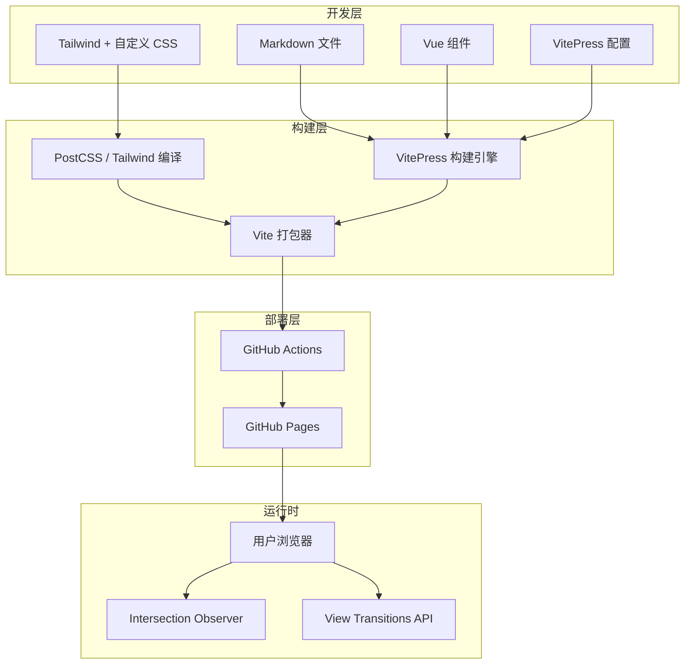
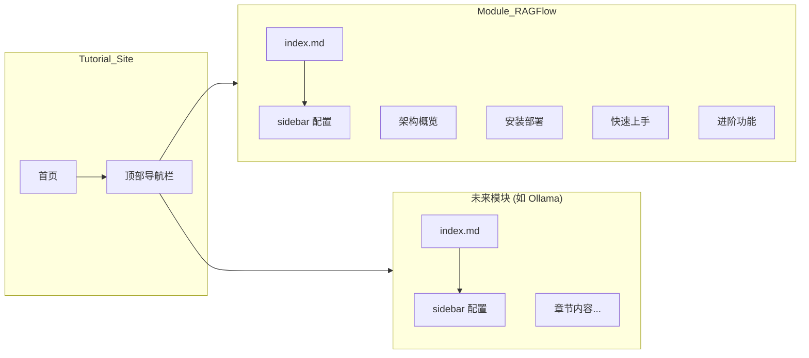
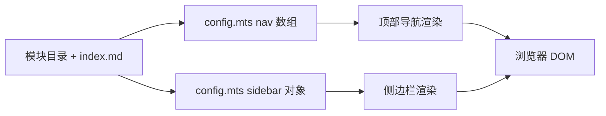

# 设计文档

## 概述

本设计文档描述 RAGFlow 中文教程站点的技术架构和实现方案。该站点基于 VitePress 静态站点生成器构建，集成 Tailwind CSS 样式框架和自定义 Vue 动画组件，采用科技感暗色主题，通过 GitHub Actions 自动部署到 GitHub Pages。

项目采用多教程可扩展架构，每个教程模块（Tutorial_Module）独立维护内容和导航配置，支持后续新增 Ollama 教程等模块而无需重构。

### 设计目标

- 高效的内容创作体验：Markdown 编写 + HMR 实时预览
- 沉浸式阅读体验：科技感动效 + 响应式布局 + 无障碍兼容
- 可扩展的多模块架构：新增教程仅需添加目录并在 config.mts 中追加配置，无需修改已有模块代码
- 零干预部署：推送到 main 分支自动完成构建和发布

## 架构

### 技术栈

| 层级 | 技术选型 | 版本 | 职责 |
|------|----------|------|------|
| 站点生成 | VitePress | ~1.6 | Markdown → HTML 编译、路由、搜索 |
| 样式框架 | Tailwind CSS | ^3.4 | 原子化 CSS、响应式、暗色模式 |
| 组件框架 | Vue 3 | (VitePress 内置) | 自定义动画组件、交互逻辑 |
| CSS 处理 | PostCSS + Autoprefixer | — | Tailwind 编译、浏览器兼容 |
| 部署 | GitHub Actions | — | CI/CD 流水线 |
| 托管 | GitHub Pages | — | 静态文件托管 |

### 系统架构图



### 多模块架构模型



## 组件和接口

### 项目目录结构

```
course/
├── .vitepress/
│   ├── config.mts              # VitePress 主配置
│   ├── theme/
│   │   ├── index.ts            # 主题入口（扩展默认主题）
│   │   ├── style.css           # 全局样式 + Tailwind 指令
│   │   └── Layout.vue          # 自定义布局（注入 Intersection Observer）
│   └── components/
│       ├── FlowLine.vue        # SVG 虚线流动动画
│       ├── GlowNode.vue        # 脉冲发光节点
│       ├── AnimatedCard.vue    # 悬停交互卡片
│       ├── FlowDot.vue         # 移动粒子
│       ├── ScrollReveal.vue    # 滚动触发淡入容器
│       └── ArchDiagram.vue     # RAGFlow 架构 SVG 图
├── ragflow/
│   ├── index.md                # RAGFlow 教程首页
│   ├── architecture.md         # 架构概览
│   ├── installation.md         # 安装部署
│   ├── quickstart.md           # 快速上手
│   ├── advanced.md             # 进阶功能
│   └── assets/                 # 教程图片（WebP 格式，懒加载）
├── index.md                    # 站点首页（Hero + 模块列表）
├── package.json
├── tailwind.config.js
├── postcss.config.js
└── .github/
    └── workflows/
        └── deploy.yml          # GitHub Actions 部署配置
```

### 核心配置接口

#### VitePress 配置 (`.vitepress/config.mts`)

```typescript
import { defineConfig } from 'vitepress'

export default defineConfig({
  title: '教程站',
  description: '高质量技术教程集合',
  lang: 'zh-CN',
  base: '/<repository-name>/',

  head: [
    ['meta', { name: 'theme-color', content: '#030712' }]
  ],

  themeConfig: {
    nav: [
      { text: '首页', link: '/' },
      { text: 'RAGFlow', link: '/ragflow/' },
      // 新模块在此追加
    ],

    sidebar: {
      '/ragflow/': [
        {
          text: 'RAGFlow 教程',
          items: [
            { text: '介绍', link: '/ragflow/' },
            { text: '架构概览', link: '/ragflow/architecture' },
            { text: '安装部署', link: '/ragflow/installation' },
            { text: '快速上手', link: '/ragflow/quickstart' },
            { text: '进阶功能', link: '/ragflow/advanced' },
          ]
        }
      ]
    },

    search: {
      provider: 'local',
      options: {
        translations: {
          button: { buttonText: '搜索', buttonAriaLabel: '搜索' },
          modal: {
            noResultsText: '未找到相关结果',
            resetButtonTitle: '清除查询',
            footer: { selectText: '选择', navigateText: '切换' }
          }
        }
      }
    },

    outline: { level: [2, 3], label: '目录' },
    docFooter: { prev: '上一篇', next: '下一篇' },
    darkModeSwitchLabel: '主题',
    darkModeSwitchTitle: '切换深色模式',
  }
})
```

#### Tailwind 配置 (`tailwind.config.js`)

```javascript
/** @type {import('tailwindcss').Config} */
module.exports = {
  content: [
    './.vitepress/**/*.{vue,js,ts}',
    './**/*.md'
  ],
  darkMode: 'class',
  theme: {
    extend: {
      colors: {
        primary: '#00ffaa',
      },
      animation: {
        'dash-flow': 'dash-flow 1.5s linear infinite',
        'pulse-glow': 'pulse-glow 2.5s ease-in-out infinite',
        'dot-move': 'dot-move 2s ease-in-out infinite',
        'fade-in-up': 'fade-in-up 0.8s ease-out forwards',
        'shimmer': 'shimmer 3s ease-in-out infinite',
      },
      keyframes: {
        'dash-flow': {
          to: { 'stroke-dashoffset': '-20' }
        },
        'pulse-glow': {
          '0%, 100%': { 'box-shadow': '0 0 8px rgba(0,255,170,0.3), 0 0 16px rgba(0,255,170,0.1)' },
          '50%': { 'box-shadow': '0 0 16px rgba(0,255,170,0.6), 0 0 32px rgba(0,255,170,0.3)' }
        },
        'dot-move': {
          '0%': { transform: 'translateX(0)', opacity: '0' },
          '10%': { opacity: '1' },
          '90%': { opacity: '1' },
          '100%': { transform: 'translateX(160px)', opacity: '0' }
        },
        'fade-in-up': {
          from: { opacity: '0', transform: 'translateY(20px)' },
          to: { opacity: '1', transform: 'translateY(0)' }
        },
        'shimmer': {
          '0%': { 'background-position': '-200% center' },
          '100%': { 'background-position': '200% center' }
        }
      }
    }
  }
}
```

#### PostCSS 配置 (`postcss.config.js`)

```javascript
module.exports = {
  plugins: {
    tailwindcss: {},
    autoprefixer: {}
  }
}
```

### Vue 动画组件接口

#### FlowLine.vue

SVG 虚线流动动画组件，可在 Markdown 中通过 `<FlowLine />` 引用。

```typescript
interface FlowLineProps {
  width?: number      // SVG 宽度，默认 200
  height?: number     // SVG 高度，默认 4
  color?: string      // 线条颜色，默认 'rgba(0,255,170,0.4)'
  speed?: number      // 动画速度 (秒)，默认 1.5
}
```

#### GlowNode.vue

脉冲发光节点组件，用于架构图中标注核心组件。

```typescript
interface GlowNodeProps {
  label: string       // 节点文本标签
  icon?: string       // 图标类名（可选）
  size?: 'sm' | 'md' | 'lg'  // 尺寸，默认 'md'
}
```

#### AnimatedCard.vue

悬停交互卡片组件，用于首页功能展示区域。

```typescript
interface AnimatedCardProps {
  title: string       // 卡片标题
  description: string // 卡片描述
  icon?: string       // 图标
  link?: string       // 点击跳转链接
  delay?: number      // 出现延迟 (ms)，用于交错动画
}
```

#### ScrollReveal.vue

滚动触发淡入容器，包裹任意内容使其在进入视口时触发动画。

```typescript
interface ScrollRevealProps {
  animation?: 'fade-in-up' | 'fade-in' | 'scale-in'  // 动画类型，默认 'fade-in-up'
  delay?: number      // 延迟 (ms)，默认 0
  threshold?: number  // Intersection Observer 阈值，默认 0.1
}
```

#### ArchDiagram.vue

RAGFlow 系统架构 SVG 交互图组件，包含所有核心组件节点和数据流连线。

```typescript
interface ArchDiagramProps {
  interactive?: boolean  // 是否启用悬停高亮，默认 true
}
```

**节点布局规范：**
- 采用分层布局：用户层（Web UI）→ 服务层（API）→ 存储层（ES、MySQL、MinIO、Redis）
- 每个节点使用 GlowNode 组件渲染，尺寸为 80x40px
- 节点间连线使用 FlowLine 组件，带方向箭头
- 移动端（<768px）：节点垂直排列，连线缩短；桌面端：水平分层排列
- 悬停高亮：鼠标悬停某节点时，该节点及其直接连线高亮，其余节点降低 opacity 至 0.3

#### FlowDot.vue

移动粒子动画组件，模拟数据粒子在管线中流动的效果。

```typescript
interface FlowDotProps {
  color?: string      // 粒子颜色，默认 '#00ffaa'
  size?: number       // 粒子直径 (px)，默认 6
  distance?: number   // 移动距离 (px)，默认 160
  duration?: number   // 动画时长 (秒)，默认 2
  direction?: 'ltr' | 'rtl'  // 移动方向，默认 'ltr'
}
```

### 主题系统接口

#### View Transitions API 集成方案

在 `.vitepress/theme/Layout.vue` 中实现页面切换动画：

```typescript
// Layout.vue <script setup>
import { useRouter } from 'vitepress'

const router = useRouter()

// 拦截路由跳转，使用 View Transitions API
router.onBeforeRouteChange = (to) => {
  if (document.startViewTransition) {
    document.startViewTransition(() => {
      // VitePress 内部处理路由变化
    })
    return false // 阻止默认行为
  }
  return true // 不支持时降级为普通跳转
}
```

**CSS 过渡规则（降级方案）：**
```css
/* 不支持 View Transitions 时的降级 */
.VPContent {
  transition: opacity 0.2s ease;
}
::view-transition-old(root),
::view-transition-new(root) {
  animation-duration: 0.3s;
}
```

#### 全局样式 (`.vitepress/theme/style.css`)

```css
@tailwind base;
@tailwind components;
@tailwind utilities;

:root {
  --vp-c-brand-1: #00ffaa;
  --vp-c-brand-2: #00cc88;
  --vp-c-brand-3: #009966;
}

.dark {
  --vp-c-bg: #030712;
  --vp-c-bg-soft: #111827;
  --vp-c-bg-mute: #1f2937;
}

/* 导航栏毛玻璃效果 */
.VPNav {
  backdrop-filter: blur(12px) saturate(180%);
  background: rgba(3, 7, 18, 0.8) !important;
}

/* 代码块 Shimmer */
.vp-doc div[class*="language-"] {
  position: relative;
  overflow: hidden;
}
.vp-doc div[class*="language-"]::after {
  content: '';
  position: absolute;
  inset: 0;
  background: linear-gradient(90deg, transparent 0%, rgba(0,255,170,0.03) 50%, transparent 100%);
  background-size: 200% 100%;
  animation: shimmer 3s ease-in-out infinite;
  pointer-events: none;
}

/* 无障碍：减少动画偏好 */
@media (prefers-reduced-motion: reduce) {
  *, *::before, *::after {
    animation-duration: 0.01ms !important;
    animation-iteration-count: 1 !important;
    transition-duration: 0.01ms !important;
  }
}
```

### GitHub Actions 部署接口

#### 工作流配置 (`.github/workflows/deploy.yml`)

```yaml
name: Deploy to GitHub Pages

on:
  push:
    branches: [main]

permissions:
  contents: read
  pages: write
  id-token: write

concurrency:
  group: pages
  cancel-in-progress: false

jobs:
  build:
    runs-on: ubuntu-latest
    steps:
      - uses: actions/checkout@v4
      - uses: actions/setup-node@v4
        with:
          node-version: 20
          cache: npm
      - run: npm ci
      - run: npm run docs:build
      - uses: actions/upload-pages-artifact@v3
        with:
          path: .vitepress/dist

  deploy:
    environment:
      name: github-pages
      url: ${{ steps.deployment.outputs.page_url }}
    needs: build
    runs-on: ubuntu-latest
    steps:
      - id: deployment
        uses: actions/deploy-pages@v4
```

## 模块扩展指南

本节说明如何为站点新增一个教程模块（如 Ollama、Dify、LangChain 等）。

### 新增模块步骤

| 步骤 | 操作 | 文件 |
|------|------|------|
| 1 | 创建模块目录和入口文件 | `<module>/index.md` + `<module>/assets/` |
| 2 | 在 nav 数组中追加入口 | `.vitepress/config.mts` |
| 3 | 在 sidebar 对象中追加章节配置 | `.vitepress/config.mts` |
| 4 | 在首页 features 列表中追加模块卡片 | `index.md` frontmatter |
| 5 | (可选) 创建模块专属组件 | `.vitepress/components/<Module>Diagram.vue` |

### 组件分类

| 类型 | 说明 | 可跨模块复用 |
|------|------|:---:|
| **通用动画组件** | FlowLine、FlowDot、AnimatedCard、GlowNode、ScrollReveal | ✅ |
| **模块专属组件** | ArchDiagram (RAGFlow 架构图) | ❌ |

新模块如需架构图或其他模块级交互组件，应按 `<ModuleName>Diagram.vue` 命名约定创建在 `.vitepress/components/` 目录下，并在 `.vitepress/theme/index.ts` 中注册。

### 模块目录模板

```
<module-name>/
├── index.md            # 模块首页（必须）
├── assets/             # 模块图片目录
│   └── .gitkeep
├── chapter-1.md        # 章节内容
├── chapter-2.md
└── ...
```

### config.mts 修改示例

```typescript
// 1. nav 追加
nav: [
  { text: '首页', link: '/' },
  { text: 'RAGFlow', link: '/ragflow/' },
  { text: 'Ollama', link: '/ollama/' },  // ← 新增
],

// 2. sidebar 追加
sidebar: {
  '/ragflow/': [ /* 已有配置 */ ],
  '/ollama/': [                           // ← 新增
    {
      text: 'Ollama 教程',
      items: [
        { text: '介绍', link: '/ollama/' },
        { text: '安装', link: '/ollama/installation' },
      ]
    }
  ]
}
```

### 首页 features 追加示例

```yaml
features:
  - title: RAGFlow 教程
    details: 从零掌握 RAGFlow 检索增强生成引擎
    link: /ragflow/
    icon: 🔍
  - title: Ollama 教程          # ← 新增
    details: 本地部署和使用开源大语言模型
    link: /ollama/
    icon: 🦙
```

### 扩展性边界

当前架构适用于 **2-5 个模块** 的规模。当模块数超过 5 个时，以下方面可能需要额外设计：

| 维度 | 当前状态 | 5+ 模块时的潜在问题 | 预备方案 |
|------|----------|---------------------|----------|
| 搜索 | 全站全文搜索 | 搜索结果混杂多模块 | 后续可加搜索范围筛选 |
| 构建速度 | 全量构建 | 10+ 模块构建时间 > 60s | 可考虑 monorepo 拆分 |
| 导航 | 平铺 nav 数组 | 导航栏过长 | 改为下拉菜单分组 |
| 首页 | features 列表 | 列表过长 | 改为分类 Tab 或网格布局 |
| 主题 | 统一暗色主题 | 不同模块需不同强调色 | 按路径前缀设置 CSS 变量覆盖 |

## 数据模型

### Tutorial Module 配置模型

每个教程模块遵循以下结构约定。模块在导航中的顺序由 `config.mts` 的 `nav` 数组索引位置决定。

```typescript
interface TutorialModule {
  /** 模块目录名，作为 URL 路径前缀 */
  slug: string
  /** 模块显示名称 */
  title: string
  /** 一句话简介（不超过 100 字符） */
  description: string
  /** 侧边栏导航配置 */
  sidebar: SidebarItem[]
}

interface SidebarItem {
  text: string
  link?: string
  items?: SidebarItem[]
  collapsed?: boolean
}
```

> **注意：** 新增模块需要在 `config.mts` 中手动添加 nav 和 sidebar 配置。VitePress 不支持目录自动发现。

### 首页模块列表数据结构

首页通过 VitePress frontmatter 和 Vue 组件渲染模块列表：

```yaml
# index.md frontmatter
---
layout: home
hero:
  name: 技术教程站
  tagline: 高质量中文技术教程
features:
  - title: RAGFlow 教程
    details: 从零掌握 RAGFlow 检索增强生成引擎的架构、部署和使用
    link: /ragflow/
    icon: 🔍
---
```

### 导航数据流



### 动画系统色彩变量

| 变量名 | 值 | 用途 |
|--------|-----|------|
| `--bg-primary` | `#030712` (gray-950) | 页面主背景 |
| `--bg-card` | `#111827` (gray-900) | 卡片/区块背景 |
| `--border-default` | `#1f2937` (gray-800) | 默认边框 |
| `--border-active` | emerald-700 | 激活/悬停边框 |
| `--accent` | `#00ffaa` | 发光、强调、动画主色 |
| `--text-primary` | `#ffffff` | 标题文字 |
| `--text-secondary` | `#9ca3af` (gray-400) | 正文文字 |

## 错误处理

### 构建阶段错误

| 错误类型 | 检测方式 | 处理策略 |
|----------|----------|----------|
| Markdown 语法错误 | VitePress 内置检测 | 终止构建，输出错误文件路径和行号 |
| 文件引用缺失（死链） | VitePress deadLinks 配置 | 终止构建，报告缺失链接及来源文件 |
| 模块缺少 index.md | 自定义构建脚本校验 | 输出警告，跳过该模块，继续构建其余内容 |
| Vue 组件编译错误 | Vite 编译器 | 终止构建，输出组件文件路径和错误详情 |
| Tailwind 类名未识别 | Tailwind Purge | 静默忽略（不影响构建），但对应样式不会输出 |

### 部署阶段错误

| 错误类型 | 检测方式 | 处理策略 |
|----------|----------|----------|
| 构建失败 | GitHub Actions 步骤退出码 | 标记工作流失败，不更新已部署站点 |
| Pages 权限不足 | GitHub API 错误响应 | 在 Actions 日志中输出错误，需手动检查仓库权限设置 |
| Artifact 上传失败 | actions/upload-pages-artifact | 重试机制（GitHub Actions 内置），失败则终止部署 |

### 运行时容错

| 场景 | 处理策略 |
|------|----------|
| 浏览器不支持 View Transitions API | 条件检测 `document.startViewTransition`，不支持时降级为普通导航 |
| Intersection Observer 不可用 | 降级为直接显示内容（无动画） |
| 搜索无结果 | 显示中文"未找到相关结果"提示 |
| 用户偏好减少动画 | `prefers-reduced-motion: reduce` 媒体查询禁用循环动画 |

### VitePress 配置中的错误处理

```typescript
// .vitepress/config.mts
export default defineConfig({
  // 死链检测：构建时发现死链则报错
  ignoreDeadLinks: false,

  // Vite 构建选项
  vite: {
    build: {
      // 构建错误提前暴露
      rollupOptions: {
        onwarn(warning, warn) {
          // 将特定警告提升为错误
          if (warning.code === 'UNRESOLVED_IMPORT') {
            throw new Error(warning.message)
          }
          warn(warning)
        }
      }
    }
  }
})
```

## 性能预算

本站点作为静态教程站，需确保在中等网络条件下也能快速加载。

### 目标指标

| 指标 | 目标值 | 测量方式 |
|------|--------|----------|
| 首次加载体积（gzip） | ≤ 500KB（HTML+CSS+JS，不含图片） | `npm run docs:build` 后检查 dist 目录 |
| Lighthouse Performance | ≥ 90（桌面模式） | Chrome DevTools Lighthouse 面板 |
| 首次内容绘制 (FCP) | ≤ 1.5s | Lighthouse 报告 |
| 最大内容绘制 (LCP) | ≤ 2.5s | Lighthouse 报告 |

### 实现策略

- **代码分割**：VitePress 自动按路由分割 JS 包，无需额外配置
- **图片懒加载**：教程中所有图片使用 `loading="lazy"` 属性，首屏可见图片除外
- **图片存储**：教程截图存放在 `ragflow/assets/` 目录，使用 WebP 格式，单张不超过 200KB
- **CSS 裁剪**：Tailwind 的 content 配置确保只输出实际使用的样式类
- **字体策略**：使用系统字体栈，不加载自定义字体文件

### 图片管理规范

```
ragflow/
├── assets/
│   ├── architecture-overview.webp
│   ├── quickstart-step1.webp
│   ├── quickstart-step2.webp
│   └── ...
```

- 格式：优先 WebP，兼容用 PNG
- 尺寸：最大宽度 1200px，适合 2x 视网膜屏
- 压缩：质量 80%，单张不超过 200KB
- 命名：kebab-case，语义化命名（如 `quickstart-create-kb.webp`）

## 测试策略

### 为什么不使用属性测试 (PBT)

本项目属于静态站点生成 + 内容创作 + UI 渲染 + CI/CD 部署类型，不包含具有复杂输入变化的纯函数逻辑。主要测试需求集中在：
- 构建配置是否正确（配置验证）
- 页面是否正确渲染（UI 渲染）
- 部署流程是否通畅（集成测试）
- 内容结构是否符合规范（静态检查）

这些场景不具备"对任意输入，某属性恒成立"的特征，因此不适用属性测试。

### 测试分层

#### 1. 构建验证测试（Smoke Tests）

验证站点能成功构建，确保配置正确：

```bash
# 本地执行
npm run docs:build
```

测试点：
- VitePress 构建成功退出（exit code 0）
- 输出目录 `.vitepress/dist` 存在且包含 `index.html`
- 生成的 HTML 文件 `lang` 属性为 `zh-CN`
- 每个教程模块的 `index.html` 存在于对应路径

#### 2. 内容结构验证（Lint / 静态检查）

使用脚本或 markdownlint 验证内容规范：

- 每个模块目录必须包含 `index.md`
- Markdown 文件内部链接无死链（VitePress `ignoreDeadLinks: false`）
- 首页 features 列表中每个模块有 title、details、link 字段

#### 3. 组件单元测试（Example-based）

使用 Vitest + @vue/test-utils 对 Vue 组件进行测试：

| 组件 | 测试内容 |
|------|----------|
| `FlowLine.vue` | 渲染 SVG 元素，包含正确的 stroke-dasharray 属性 |
| `GlowNode.vue` | 渲染 label 文本，应用 animate-pulse-glow 类 |
| `AnimatedCard.vue` | 渲染 title/description，悬停时应用 hover 类 |
| `FlowDot.vue` | 渲染正确尺寸和颜色的粒子元素，动画使用 translateX |
| `ScrollReveal.vue` | 初始状态 opacity 为 0，模拟 intersect 后 opacity 变为 1 |

#### 4. 视觉回归测试

可选使用 Playwright 截图对比：
- 首页 Hero 区域渲染正确
- 暗色/浅色模式切换后视觉一致性
- 响应式布局（移动端 / 桌面端）

#### 5. 部署集成测试

通过 GitHub Actions 工作流自身的状态验证：
- 推送到 main 后 Actions 绿标
- 部署后访问 GitHub Pages URL 返回 200

### 测试命令

```json
{
  "scripts": {
    "docs:dev": "vitepress dev",
    "docs:build": "vitepress build",
    "docs:preview": "vitepress preview",
    "test": "vitest run",
    "test:build": "npm run docs:build && node scripts/validate-build.js"
  }
}
```

### 推荐测试工具

| 工具 | 用途 |
|------|------|
| Vitest | Vue 组件单元测试 |
| @vue/test-utils | Vue 组件挂载与交互 |
| Playwright | E2E 测试、视觉回归 |
| markdownlint | Markdown 格式检查 |
| 自定义脚本 | 构建产物结构验证 |
