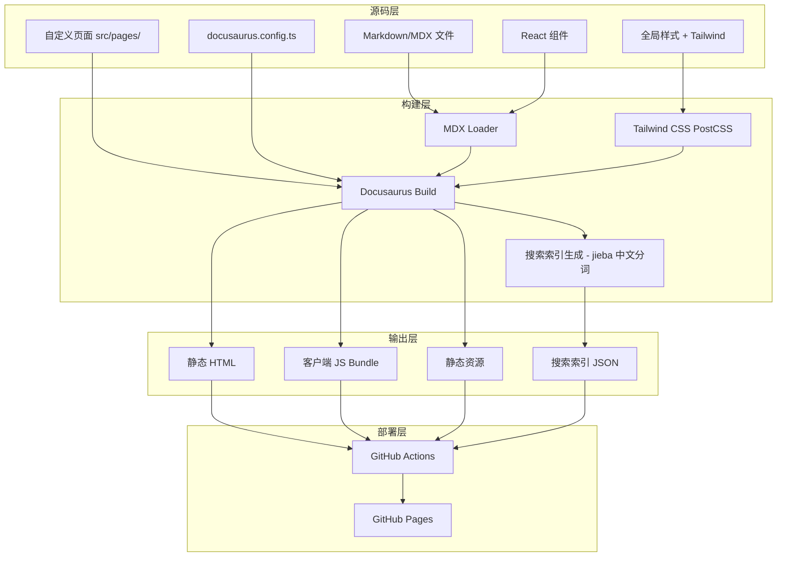

# Design Document: React Migration

## Overview

本设计文档描述将现有 VitePress（Vue）技术教程站点迁移到基于 React 的静态站点生成器的技术方案。迁移选用 **Docusaurus 3** 作为目标框架，因其原生支持 MDX、静态站点生成、本地搜索、中文分词、侧边栏/导航栏配置、以及 GitHub Pages 部署——与现有 VitePress 功能集高度对齐。

### 技术选型理由

| 候选方案 | 优势 | 劣势 | 结论 |
|---------|------|------|------|
| **Docusaurus 3** | 原生 MDX、内置搜索（含中文）、sidebar/nav 配置式声明、静态输出、社区活跃 | 文档站定位较强 | ✅ 选用 |
| Next.js (App Router) | 灵活性高、SSG/SSR 混合 | 需手动实现 sidebar/TOC/search/prev-next，工作量大 | ❌ 排除 |
| Astro + React | 支持 MDX、性能好 | 搜索/导航需第三方插件，生态较新 | ❌ 排除 |

## Architecture



### 目录结构

```
course/
├── docusaurus.config.ts          # Docusaurus 主配置
├── sidebars.ts                   # 侧边栏配置
├── package.json                  # 依赖和脚本
├── tailwind.config.js            # Tailwind CSS 配置
├── postcss.config.js             # PostCSS 配置（含 tailwindcss 插件）
├── src/
│   ├── components/               # React 组件
│   │   ├── AnimatedCard.tsx
│   │   ├── ScrollReveal.tsx
│   │   ├── FlowDot.tsx
│   │   ├── FlowLine.tsx
│   │   ├── GlowNode.tsx
│   │   ├── ArchDiagram.tsx
│   │   └── __tests__/            # 组件测试
│   │       ├── AnimatedCard.test.tsx
│   │       ├── ScrollReveal.test.tsx
│   │       ├── FlowDot.test.tsx
│   │       ├── FlowLine.test.tsx
│   │       ├── GlowNode.test.tsx
│   │       └── ArchDiagram.test.tsx
│   ├── css/
│   │   └── custom.css            # 全局自定义样式（含 CSS 变量、动画关键帧）
│   ├── pages/
│   │   └── index.tsx             # 首页 React 组件（替代 VitePress layout:home）
│   └── theme/                    # Docusaurus 主题覆写
│       └── Footer/               # 可选的页脚定制
├── docs/                         # Markdown/MDX 内容（从根目录迁入）
│   ├── ragflow/
│   │   ├── index.mdx             # 包含组件引用的文件使用 .mdx 扩展名
│   │   ├── architecture.md
│   │   ├── installation.md
│   │   ├── quickstart.md
│   │   └── advanced.md
│   ├── ai_tech/
│   ├── basketball_skill/
│   ├── book_read/
│   ├── life_wish/
│   └── site_build/
│       └── beta/
│           └── css-animation-guide.md
├── static/                       # 静态资源
│   ├── img/                      # 图片资源（从各模块 assets/ 迁入）
│   └── site_build/
│       └── beta/
│           └── demo-animation.html  # 非 Markdown 静态文件
├── .github/
│   └── workflows/
│       └── deploy.yml            # GitHub Pages 部署工作流
└── vitest.config.ts              # 测试配置
```

### 关键架构决策

1. **首页与文档路由**：设置 `docs.routeBasePath: '/'`，文档占据根路径。同时使用 `src/pages/index.tsx` 作为自定义首页。Docusaurus 中 `src/pages/` 下的页面优先级高于 docs 根路径，两者不冲突。最终路由映射：
   - 首页：`src/pages/index.tsx` → `/course/`
   - ragflow 介绍：`docs/ragflow/index.md` → `/course/ragflow/`
   - ragflow 架构：`docs/ragflow/architecture.md` → `/course/ragflow/architecture`

2. **Tailwind 与 Docusaurus 共存**：禁用 Tailwind 的 `preflight`（CSS reset），避免覆盖 Docusaurus Infima 基础样式。使用 `darkMode: ['selector', '[data-theme="dark"]']` 与 Docusaurus 暗色模式属性对齐。

3. **组件引用方式**：VitePress 全局自动注册组件，Docusaurus MDX 需要显式 import。所有使用自定义组件的内容文件必须使用 `.mdx` 扩展名并在文件头部 import 组件。

## Migration Execution Plan

### 阶段 1：项目初始化

1. 创建新的 Docusaurus 3 项目骨架（使用 `@docusaurus/preset-classic`）
2. 配置 `package.json` scripts: `build`、`dev`（`docusaurus start`）、`test`
3. 安装 Tailwind CSS 并配置 PostCSS 集成
4. 安装搜索插件 `@easyops-cn/docusaurus-search-local`

### 阶段 2：内容迁移

1. 将 `ragflow/`、`ai_tech/`、`basketball_skill/`、`book_read/`、`life_wish/`、`site_build/` 目录移动到 `docs/` 下
2. 将各模块 `assets/` 目录内容移动到 `static/img/` 并更新引用路径
3. 将 `site_build/beta/demo-animation.html` 移动到 `static/site_build/beta/`
4. 转换包含 Vue 组件标签的 .md 文件为 .mdx 格式，添加 import 语句
5. 移除 VitePress 专有 frontmatter（`layout`），添加 Docusaurus 兼容字段（`sidebar_position`、`slug`）

### 阶段 3：组件实现

1. 在 `src/components/` 中实现所有 6 个 React 动画组件
2. 在 `src/pages/index.tsx` 中实现首页（hero + flow visualization + card grid）
3. 编写组件测试文件

### 阶段 4：主题与配置

1. 配置 `docusaurus.config.ts`（navbar、sidebar、colorMode、i18n）
2. 实现 `src/css/custom.css`（CSS 变量、动画关键帧、毛玻璃效果）
3. 配置 Tailwind 暗色模式与 Docusaurus 对齐
4. 配置搜索插件（中文分词、结果限制）

### 阶段 5：CI/CD 更新

1. 更新 `.github/workflows/deploy.yml` 使用 `npm run build` 并部署 `build/` 目录
2. 确保 GitHub Actions 使用 Node.js 18+

### 阶段 6：清理

1. 删除 `.vitepress/` 目录（包括其中的旧 Vue 组件和对应的 `.test.ts` 测试文件）
2. 删除根目录下的内容模块目录（已迁入 `docs/`）
3. 从 `package.json` 移除 vue、vitepress、@vue/* 依赖
4. 删除旧的 `vitest.config.ts`（已由新配置替代）
5. 运行 `npm run build` 验证构建成功
6. 运行 `npm run test` 验证所有新组件测试通过
3. 从 `package.json` 移除 vue、vitepress、@vue/* 依赖
4. 删除旧的 `vitest.config.ts`（如果内容需更新）
5. 运行 `npm run build` 验证构建成功

## Components and Interfaces

### 1. AnimatedCard 组件

```typescript
interface AnimatedCardProps {
  title: string;           // 必需：卡片标题
  description: string;     // 必需：卡片描述
  icon?: string;           // 可选：emoji 图标
  link?: string;           // 可选：跳转链接
  delay?: number;          // 可选：动画延迟，默认 0ms
}
```

**行为规约：**
- 有 `link` 时渲染 `<a href={link}>`，否则渲染 `<div>`
- 应用 `fade-in-up` CSS 动画，`animationDelay` 等于 `delay` 值
- 悬停时 `transform: translateY(-4px)` + `border-color: var(--color-brand)`

### 2. ScrollReveal 组件

```typescript
interface ScrollRevealProps {
  animation?: 'fade-in-up' | 'fade-in' | 'scale-in';  // 默认 'fade-in-up'
  delay?: number;                                       // 默认 0ms
  threshold?: number;                                   // 默认 0.1
  children: React.ReactNode;
}
```

**行为规约：**
- 使用 `IntersectionObserver` 监听元素可见性
- 进入视口后触发动画（一次性，不重复）
- `IntersectionObserver` 不可用时直接显示内容（`isVisible = true`）

### 3. FlowDot 组件

```typescript
interface FlowDotProps {
  color?: string;              // 默认 '#00ffaa'
  size?: number;               // 默认 6 (px)
  distance?: number;           // 默认 160 (px)
  duration?: number;           // 默认 2 (s)
  direction?: 'ltr' | 'rtl';  // 默认 'ltr'
}
```

**行为规约：**
- 渲染圆形 `<span>`，`border-radius: 50%`
- CSS 变量 `--dot-distance` 和 `--dot-duration` 控制动画
- `aria-hidden="true"`（装饰性元素）

### 4. FlowLine 组件

```typescript
interface FlowLineProps {
  width?: number;    // 默认 200
  height?: number;   // 默认 4
  color?: string;    // 默认 'rgba(0,255,170,0.4)'
  speed?: number;    // 默认 1.5 (s)
}
```

**行为规约：**
- 渲染 `<svg>` 包含 `<line>` 元素
- `stroke-dasharray="8 6"`，`stroke-linecap="round"`
- `dash-flow` 动画控制虚线流动
- `aria-hidden="true"`（装饰性元素）

### 5. GlowNode 组件

```typescript
interface GlowNodeProps {
  label: string;                      // 必需：节点文本
  icon?: string;                      // 可选：图标 class
  size?: 'sm' | 'md' | 'lg';         // 默认 'md'
}
```

**行为规约：**
- 圆角胶囊形（`border-radius: 9999px`）
- 品牌色发光 `box-shadow: 0 0 8px rgba(0,255,170,0.4)`
- 脉冲动画（`pulse-glow`）
- 尺寸映射：sm → `px-2 py-1 text-xs`，md → `px-4 py-2 text-sm`，lg → `px-6 py-3 text-base`

### 6. ArchDiagram 组件

```typescript
interface ArchDiagramProps {
  interactive?: boolean;  // 默认 true
}
```

**内部数据（硬编码，与原 Vue 组件一致）：**

```typescript
const nodes: NodeDef[] = [
  { id: 'webui', label: 'Web UI', layer: 'user' },
  { id: 'api', label: 'API Server', layer: 'service' },
  { id: 'es', label: 'Elasticsearch', layer: 'storage' },
  { id: 'mysql', label: 'MySQL', layer: 'storage' },
  { id: 'minio', label: 'MinIO', layer: 'storage' },
  { id: 'redis', label: 'Redis', layer: 'storage' },
];

const connections: ConnectionDef[] = [
  { from: 'webui', to: 'api' },
  { from: 'api', to: 'es' },
  { from: 'api', to: 'mysql' },
  { from: 'api', to: 'minio' },
  { from: 'api', to: 'redis' },
];
```

**行为规约：**
- 三层架构布局，每层显示标签（用户层、服务层、存储层）
- 悬停时高亮相关节点/连线（opacity 1），其余淡化（opacity 0.3），过渡 ≤300ms
- `interactive=false` 时不改变任何透明度
- 响应式：桌面端水平排列，移动端垂直排列
- `role="img"` + `aria-label="RAGFlow 系统架构图"`

### 7. Docusaurus 配置接口

```typescript
// docusaurus.config.ts 关键配置
import type { Config } from '@docusaurus/types';

const config: Config = {
  title: '技术教程站',
  tagline: '高质量中文技术教程',
  url: 'https://<username>.github.io',
  baseUrl: '/course/',
  
  onBrokenLinks: 'throw',           // 断链时终止构建
  onBrokenMarkdownLinks: 'throw',   // Markdown 断链时终止构建
  
  i18n: {
    defaultLocale: 'zh-Hans',
    locales: ['zh-Hans'],
  },
  
  headTags: [
    { tagName: 'meta', attributes: { name: 'theme-color', content: '#030712' } },
  ],
  
  presets: [['classic', {
    docs: {
      routeBasePath: '/',              // 文档占据根路径
      sidebarPath: './sidebars.ts',
      showLastUpdateTime: false,
    },
    theme: {
      customCss: './src/css/custom.css',
    },
  }]],
  
  themeConfig: {
    navbar: {
      title: '技术教程站',
      items: [
        { to: '/', label: '首页', position: 'left' },
        { to: '/ragflow/', label: 'RAGFlow', position: 'left' },
      ],
    },
    colorMode: {
      defaultMode: 'dark',
      disableSwitch: true,     // 仅暗色模式
      respectPrefersColorScheme: false,
    },
    docs: {
      sidebar: { hideable: true },
    },
    tableOfContents: {
      minHeadingLevel: 2,
      maxHeadingLevel: 3,
    },
  },
};
```

### 8. 搜索系统接口

使用 `@easyops-cn/docusaurus-search-local` 插件：

```typescript
// docusaurus.config.ts themes 配置
themes: [
  ['@easyops-cn/docusaurus-search-local', {
    indexDocs: true,
    indexPages: true,
    language: ['zh', 'en'],
    hashed: true,
    highlightSearchTermsOnTargetPage: true,
    searchResultLimits: 20,
    searchBarShortcutHint: false,
    docsRouteBasePath: '/',
    translations: {
      search_placeholder: '搜索',
      see_all_results: '查看所有结果',
      no_results: '未找到相关结果',
    },
  }],
],
```

### 9. Tailwind CSS 集成

```javascript
// tailwind.config.js
/** @type {import('tailwindcss').Config} */
module.exports = {
  content: [
    './src/**/*.{js,jsx,ts,tsx}',
    './docs/**/*.{md,mdx}',
  ],
  darkMode: ['selector', '[data-theme="dark"]'],  // 与 Docusaurus 对齐
  theme: {
    extend: {
      colors: {
        primary: '#00ffaa',
        'bg-base': '#030712',
        'bg-soft': '#111827',
        'bg-mute': '#1f2937',
      },
    },
  },
  plugins: [],
  corePlugins: {
    preflight: false,  // 禁用 Tailwind reset，避免与 Docusaurus Infima 冲突
  },
};
```

```javascript
// postcss.config.js
module.exports = {
  plugins: {
    tailwindcss: {},
    autoprefixer: {},
  },
};
```

## CSS Architecture

### CSS 变量命名空间桥接

```css
/* src/css/custom.css */

/* === 自定义设计变量 === */
:root,
[data-theme='dark'] {
  --color-bg: #030712;
  --color-bg-soft: #111827;
  --color-bg-mute: #1f2937;
  --color-brand: #00ffaa;
  --color-brand-dark: #00cc88;
  --color-text: #ffffff;
  --color-text-muted: #9ca3af;
}

/* === 映射到 Docusaurus Infima 变量 === */
[data-theme='dark'] {
  --ifm-background-color: var(--color-bg);
  --ifm-background-surface-color: var(--color-bg-soft);
  --ifm-color-primary: var(--color-brand);
  --ifm-color-primary-dark: var(--color-brand-dark);
  --ifm-color-primary-light: #33ffbb;
  --ifm-color-primary-lightest: #66ffcc;
  --ifm-color-primary-darkest: #009966;
  --ifm-color-primary-darker: #00b377;
  --ifm-navbar-background-color: rgba(3, 7, 18, 0.8);
  --ifm-font-color-base: var(--color-text);
}
```

### 动画关键帧定义

```css
/* === 动画关键帧 === */
@keyframes fade-in-up {
  from {
    opacity: 0;
    transform: translateY(20px);
  }
  to {
    opacity: 1;
    transform: translateY(0);
  }
}

@keyframes fade-in {
  from { opacity: 0; }
  to { opacity: 1; }
}

@keyframes scale-in {
  from {
    opacity: 0;
    transform: scale(0.9);
  }
  to {
    opacity: 1;
    transform: scale(1);
  }
}

@keyframes dash-flow {
  from { stroke-dashoffset: 28; }
  to { stroke-dashoffset: 0; }
}

@keyframes pulse-glow {
  0%, 100% {
    box-shadow: 0 0 8px rgba(0, 255, 170, 0.4);
  }
  50% {
    box-shadow: 0 0 16px rgba(0, 255, 170, 0.7);
  }
}

@keyframes shimmer {
  0% { background-position: -200% 0; }
  100% { background-position: 200% 0; }
}

@keyframes dot-move {
  0% {
    opacity: 0;
    transform: translateX(0);
  }
  10% { opacity: 1; }
  90% { opacity: 1; }
  100% {
    opacity: 0;
    transform: translateX(var(--dot-distance));
  }
}
```

### 导航栏毛玻璃效果

```css
/* === 导航栏样式 === */
.navbar {
  backdrop-filter: blur(12px) saturate(180%);
  background: rgba(3, 7, 18, 0.8) !important;
  border-bottom: 1px solid rgba(0, 255, 170, 0.1);
}
```

### 代码块 Shimmer 效果

```css
/* === 代码块微光效果 === */
.prism-code,
[class*="codeBlock"] {
  position: relative;
  overflow: hidden;
}

[class*="codeBlock"]::after {
  content: '';
  position: absolute;
  inset: 0;
  background: linear-gradient(90deg, transparent 0%, rgba(0,255,170,0.03) 50%, transparent 100%);
  background-size: 200% 100%;
  animation: shimmer 3s ease-in-out infinite;
  pointer-events: none;
}
```

### 全局减少动画偏好

```css
/* === 无障碍：减少动画 === */
@media (prefers-reduced-motion: reduce) {
  *,
  *::before,
  *::after {
    animation-duration: 0.01ms !important;
    animation-iteration-count: 1 !important;
    transition-duration: 0.01ms !important;
  }
}
```

## Data Models

### 内容模型

```typescript
// Markdown/MDX 文件 frontmatter 结构
interface DocFrontmatter {
  title?: string;            // 页面标题 → <title> 和 sidebar 显示名
  description?: string;      // 页面描述 → <meta name="description">
  sidebar_position?: number; // 侧边栏排序
  slug?: string;             // 自定义 URL slug
}

// 导航栏条目
interface NavItem {
  label: string;
  to?: string;       // 内部链接
  href?: string;     // 外部链接
  position: 'left' | 'right';
}

// 侧边栏配置
interface SidebarConfig {
  [category: string]: SidebarItem[];
}

interface SidebarItem {
  type: 'doc' | 'category' | 'link';
  id?: string;        // 文档 ID
  label: string;
  items?: SidebarItem[];
}
```

### 搜索数据模型

```typescript
// 构建时生成的搜索索引条目（由 @easyops-cn/docusaurus-search-local 自动生成）
interface SearchIndexEntry {
  title: string;         // 页面标题
  content: string;       // 页面纯文本内容（中文经 jieba 分词处理）
  url: string;           // 页面 URL
  headings: string[];    // h2/h3 标题列表
}

// 搜索结果
interface SearchResult {
  title: string;
  url: string;
  snippet: string;       // 匹配片段，≤120 字符
  score: number;         // 相关度分数
}
```

### 动画组件状态模型

```typescript
// ScrollReveal 组件内部状态（使用 useRef + useState）
interface ScrollRevealState {
  isVisible: boolean;      // 是否已进入视口
  hasTriggered: boolean;   // 是否已触发过（一次性）
}

// ArchDiagram 交互状态（使用 useState）
interface ArchDiagramState {
  hoveredNodeId: string | null;  // 当前悬停的节点 ID
}

// 架构图数据结构（组件内硬编码）
interface NodeDef {
  id: string;
  label: string;
  layer: 'user' | 'service' | 'storage';
}

interface ConnectionDef {
  from: string;  // 源节点 ID
  to: string;    // 目标节点 ID
}
```

## Correctness Properties

*A property is a characteristic or behavior that should hold true across all valid executions of a system—essentially, a formal statement about what the system should do. Properties serve as the bridge between human-readable specifications and machine-verifiable correctness guarantees.*

### Component-Level Properties (Property-Based Testing with fast-check)

#### Property 1: AnimatedCard 渲染正确性

*For any* valid combination of AnimatedCard props (title, description, optional icon/link/delay), the component SHALL render as `<a>` when `link` is provided or `<div>` otherwise, display the title and description text, and apply `animationDelay` matching the `delay` prop value in milliseconds.

**Validates: Requirements 3.1**
**Test type: Component PBT (fast-check + React Testing Library)**

#### Property 2: ScrollReveal 动画类型映射

*For any* valid `animation` prop value ('fade-in-up' | 'fade-in' | 'scale-in') and `delay` value, the ScrollReveal component SHALL render with a CSS class corresponding to the animation type and `transitionDelay` matching the delay prop.

**Validates: Requirements 3.2**
**Test type: Component PBT**

#### Property 3: FlowDot 尺寸与方向属性

*For any* valid FlowDot props (color, size, distance, duration, direction), the rendered element SHALL have `width` and `height` equal to `size` px, `backgroundColor` equal to `color`, CSS variable `--dot-distance` equal to `distance` (negated for 'rtl'), and `--dot-duration` equal to `duration` seconds.

**Validates: Requirements 3.3**
**Test type: Component PBT**

#### Property 4: FlowLine SVG 属性正确性

*For any* valid FlowLine props (width, height, color, speed), the rendered SVG SHALL have `width` and `height` attributes matching the props, contain a `<line>` element with `stroke` equal to `color`, `stroke-dasharray` of "8 6", and animation duration equal to `speed` seconds.

**Validates: Requirements 3.4**
**Test type: Component PBT**

#### Property 5: GlowNode 尺寸映射

*For any* valid GlowNode props (label, optional icon, size from 'sm'|'md'|'lg'), the component SHALL render the label text, apply the correct size-specific CSS classes (sm→`px-2 py-1 text-xs`, md→`px-4 py-2 text-sm`, lg→`px-6 py-3 text-base`), and conditionally render the icon element only when provided.

**Validates: Requirements 3.5**
**Test type: Component PBT**

### Build-Output Properties (Integration Tests - post-build HTML analysis)

#### Property 6: Markdown 渲染语义保持

*For any* valid Markdown 文件 containing frontmatter with a `title` field and fenced code blocks with a language identifier, the rendered HTML output SHALL contain a `<title>` element matching the frontmatter title value AND code block elements with language-specific class attributes for syntax highlighting.

**Validates: Requirements 1.2, 2.3, 2.4**
**Test type: Build-output integration test (parse generated HTML)**

#### Property 7: Base Path 一致性

*For any* generated HTML page in the build output, all internal navigation links (`<a href="...">`) and static asset references (`<link>`, `<script>`, `` src attributes) pointing to site-internal resources SHALL have paths prefixed with `/course/`.

**Validates: Requirements 1.5**
**Test type: Build-output integration test**

#### Property 8: 构建完整性

*For any* Markdown file present in the source `docs/` directory, a corresponding HTML file SHALL exist in the build output directory at the path derived from its source location.

**Validates: Requirements 1.6, 2.1**
**Test type: Build-output integration test**

#### Property 9: URL 路径结构映射

*For any* Markdown file located at `docs/<module>/<filename>.md`, the generated page SHALL be accessible at the URL path `/<base>/<module>/<filename>`, and for `index.md` files the path SHALL be `/<base>/<module>/`.

**Validates: Requirements 2.2**
**Test type: Build-output integration test**

### Navigation Properties (Integration Tests)

#### Property 10: TOC 标题提取

*For any* Markdown content containing h2 and h3 headings, the generated page TOC (table of contents) SHALL contain entries for all h2 and h3 headings in document order, and clicking any TOC entry SHALL link to the corresponding heading anchor.

**Validates: Requirements 5.3**
**Test type: Build-output integration test (parse TOC HTML structure)**

#### Property 11: Prev/Next 导航边界正确性

*For any* page at position `i` in a module's ordered page sequence of length `n`, the page SHALL display a "next" link if `i < n-1` and a "prev" link if `i > 0`; the first page SHALL NOT display "prev" and the last page SHALL NOT display "next".

**Validates: Requirements 5.4**
**Test type: Build-output integration test**

### Search Properties (Search Index Integration Tests)

#### Property 12: 搜索结果约束

*For any* non-empty search query against the site content index, the search results SHALL contain at most 20 items, each result's snippet SHALL be no longer than 120 characters, and results SHALL be ordered by descending relevance score.

**Validates: Requirements 7.2**
**Test type: Search index integration test (load index, execute query, verify constraints)**

#### Property 13: 中文分词搜索匹配

*For any* Chinese keyword of at least 2 characters that appears in any indexed page's content, searching for that keyword SHALL return at least one result containing that page.

**Validates: Requirements 7.3**
**Test type: Search index integration test**

## Error Handling

### 构建阶段错误

| 错误场景 | 处理策略 | 配置项 |
|---------|---------|--------|
| Markdown 语法错误 | Docusaurus MDX 解析器报错并终止构建，输出文件路径和行号 | 内置行为 |
| MDX 中引入不存在的组件 | 构建时 import 失败，报错并终止，输出未解析的模块名 | 内置行为 |
| 内部链接指向不存在的页面 | 构建终止并报告断链 | `onBrokenLinks: 'throw'` |
| Markdown 内部链接断裂 | 构建终止并报告断链 | `onBrokenMarkdownLinks: 'throw'` |
| 资源文件引用丢失 | 构建终止并报告缺失文件 | `onBrokenMarkdownLinks: 'throw'` |
| Tailwind CSS 类名解析失败 | PostCSS 构建阶段报错，输出相关文件信息 | PostCSS 错误 |

### 运行时错误

| 错误场景 | 处理策略 |
|---------|---------|
| `IntersectionObserver` 不可用 | ScrollReveal 组件降级处理：直接设 `isVisible=true` 显示内容 |
| 搜索索引加载失败 | 搜索组件显示错误提示，不影响页面其他功能 |
| 搜索无结果 | 显示"未找到相关结果"提示信息 |
| 动画组件 props 无效 | 使用 TypeScript 类型和默认值确保运行时不崩溃 |
| 用户启用 `prefers-reduced-motion` | 全局 CSS 媒体查询将所有动画/过渡时长设为 0.01ms |

### 部署阶段错误

| 错误场景 | 处理策略 |
|---------|---------|
| 构建失败（退出码非 0） | GitHub Actions deploy job 配置 `needs: build`，build 失败则跳过部署 |
| GitHub Pages 部署失败 | Workflow 标记为失败，保留上一个成功部署的版本 |

## Testing Strategy

### 测试框架配置

- **测试运行器：** Vitest
- **组件测试：** React Testing Library + happy-dom
- **属性测试库：** fast-check（用于 component-level property-based testing）
- **构建验证：** Node.js 脚本解析 HTML 产物
- **测试文件模式：** `**/*.test.ts` 和 `**/*.test.tsx`

### 测试分类

#### 1. Component Property-Based Tests（组件属性测试）— Properties 1-5

使用 `fast-check` 库在 Vitest 中运行。每个属性测试：
- 最少运行 100 次迭代
- 标注对应的设计文档 Property 编号
- 标签格式：`Feature: react-migration, Property {N}: {描述}`

```typescript
// 示例：Property 1 - AnimatedCard 渲染正确性
import { test } from '@fast-check/vitest';
import * as fc from 'fast-check';
import { render } from '@testing-library/react';
import { AnimatedCard } from '../AnimatedCard';

// Feature: react-migration, Property 1: AnimatedCard renders correct element type based on props
test.prop(
  [fc.string({ minLength: 1 }), fc.string({ minLength: 1 }), fc.option(fc.webUrl())],
  (title, desc, link) => {
    const { container } = render(
      <AnimatedCard title={title} description={desc} link={link ?? undefined} />
    );
    const element = container.firstElementChild;
    if (link) {
      expect(element?.tagName).toBe('A');
      expect(element?.getAttribute('href')).toBe(link);
    } else {
      expect(element?.tagName).toBe('DIV');
    }
  }
);
```

#### 2. Component Unit Tests（组件单元测试）

每个 Animation_Component 至少 2 个用例：
- 默认 props 渲染测试
- 自定义 props 渲染测试
- 特定交互行为测试（如 ArchDiagram hover）

#### 3. Build-Output Integration Tests（构建产物集成测试）— Properties 6-11

运行 `npm run build` 后通过 Node.js 脚本解析 HTML 文件：

```typescript
// scripts/validate-build.ts
import { readFileSync, readdirSync, existsSync } from 'fs';
import { join } from 'path';
import { JSDOM } from 'jsdom';

// Property 7: 验证所有内部链接包含 /course/ 前缀
function validateBasePaths(buildDir: string): void {
  const htmlFiles = findHtmlFiles(buildDir);
  for (const file of htmlFiles) {
    const dom = new JSDOM(readFileSync(file, 'utf-8'));
    const links = dom.window.document.querySelectorAll('a[href^="/"]');
    for (const link of links) {
      const href = link.getAttribute('href')!;
      if (!href.startsWith('/course/')) {
        throw new Error(`${file}: Link "${href}" missing /course/ prefix`);
      }
    }
  }
}

// Property 8: 验证每个源文件有对应 HTML 产物
function validateCompleteness(docsDir: string, buildDir: string): void {
  const mdFiles = findMarkdownFiles(docsDir);
  for (const md of mdFiles) {
    const expectedHtml = mdToHtmlPath(md, buildDir);
    if (!existsSync(expectedHtml)) {
      throw new Error(`Missing build output for: ${md}`);
    }
  }
}
```

#### 4. Search Integration Tests（搜索集成测试）— Properties 12-13

加载构建生成的搜索索引文件，模拟搜索查询：

```typescript
// src/components/__tests__/search-integration.test.ts
import { describe, it, expect } from 'vitest';

describe('Search Index Properties', () => {
  // Property 12: 搜索结果约束
  it('should return at most 20 results with snippets ≤120 chars', async () => {
    const index = await loadSearchIndex('./build/search-index.json');
    const results = search(index, 'RAGFlow');
    expect(results.length).toBeLessThanOrEqual(20);
    for (const r of results) {
      expect(r.snippet.length).toBeLessThanOrEqual(120);
    }
  });

  // Property 13: 中文分词搜索
  it('should find Chinese keywords in content', async () => {
    const index = await loadSearchIndex('./build/search-index.json');
    const results = search(index, '架构');
    expect(results.length).toBeGreaterThan(0);
    expect(results.some(r => r.url.includes('architecture'))).toBe(true);
  });
});
```

#### 5. Smoke Tests（冒烟测试）

- `package.json` 包含正确的 scripts（build、dev、test）
- 不包含 Vue/VitePress 依赖
- Vitest 配置正确
- Tailwind 配置正确（`darkMode` 使用 selector 策略）
- CSS 自定义属性定义正确
- HTML `lang` 属性为 `zh-Hans`

### 测试执行

```bash
# 运行所有组件测试（单次执行，非 watch 模式）
npm run test

# 仅运行属性测试
npx vitest run --grep "Property"

# 构建验证（需先构建）
npm run build && node scripts/validate-build.js

# 搜索集成测试（需先构建）
npx vitest run --grep "Search Index"
```

### Vitest 配置

```typescript
// vitest.config.ts
import { defineConfig } from 'vitest/config';
import react from '@vitejs/plugin-react';
import path from 'path';

export default defineConfig({
  plugins: [react()],
  resolve: {
    alias: {
      '@site': path.resolve(__dirname),
      '@site/src': path.resolve(__dirname, 'src'),
    },
  },
  test: {
    environment: 'happy-dom',
    include: ['**/*.test.{ts,tsx}'],
    exclude: ['node_modules', 'build', '.docusaurus'],
    setupFiles: ['./vitest.setup.ts'],
    coverage: {
      exclude: ['node_modules', 'build', '.docusaurus'],
    },
  },
});
```

```typescript
// vitest.setup.ts
import '@testing-library/jest-dom/vitest';
```

### 依赖清单

```json
{
  "dependencies": {
    "@docusaurus/core": "^3.4.0",
    "@docusaurus/preset-classic": "^3.4.0",
    "@easyops-cn/docusaurus-search-local": "^0.40.1",
    "react": "^18.2.0",
    "react-dom": "^18.2.0"
  },
  "devDependencies": {
    "@docusaurus/module-type-aliases": "^3.4.0",
    "@vitejs/plugin-react": "^4.3.0",
    "@testing-library/react": "^16.0.0",
    "@testing-library/jest-dom": "^6.4.0",
    "@fast-check/vitest": "^0.1.3",
    "fast-check": "^3.19.0",
    "happy-dom": "^20.10.0",
    "vitest": "^4.1.0",
    "tailwindcss": "^3.4.19",
    "autoprefixer": "^10.5.0",
    "postcss": "^8.5.0",
    "jsdom": "^24.1.0"
  }
}
```
